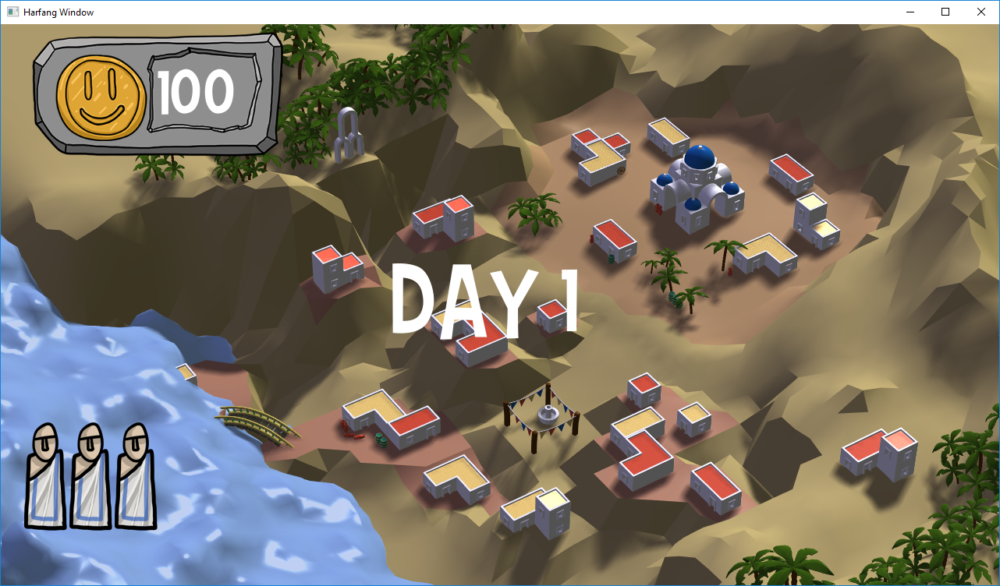

# GGJ2017-insanely-wavy-tsunami-panic
Contribution to the GGJ2017, 24 hours game made in C++ using [Harfang](https://www.harfang3d.com).

#INSANELY WAVY TSUNAMI PANIC#
*A tower defense against a flood wave*

----
Soundtrack to use while playing: https://www.youtube.com/watch?v=DGIXT7ce3vQ

----
Code: barr 
Gfx 3D: Erk/Simon Gibier 
Gfx 2D: Florian Belmonte 

----
**Erk**

Have a nice time with INSANELY WAVY TSUNAMI PANIC, the most wonderful, awesome and cute game ever made in a GGJ ! Thx to Movida team for the organisation.

**Barr**

~1000 lines of C++ using the Harfang 3D framework (I'm one of the authors). You'll find all the game logic, the primitive fluid system and left-overs in there.

The framework can draw 3D, 2D and a big toolbox to do many things including iso-surface which came in handy... it can do sound too, but meh...

Yet, doing a tower defense against fluid is hard. 3D does not make it easier. Improvising a fluid system fast enough, with plausible enough interactions then get to the game itself without running out of time was challenging.

The game logic could use a bit more tweaking but I'm going to bed so it will be fine for now.

Regards to Romain Gauthier, Arnaud Storq any many others I'm forgetting.
